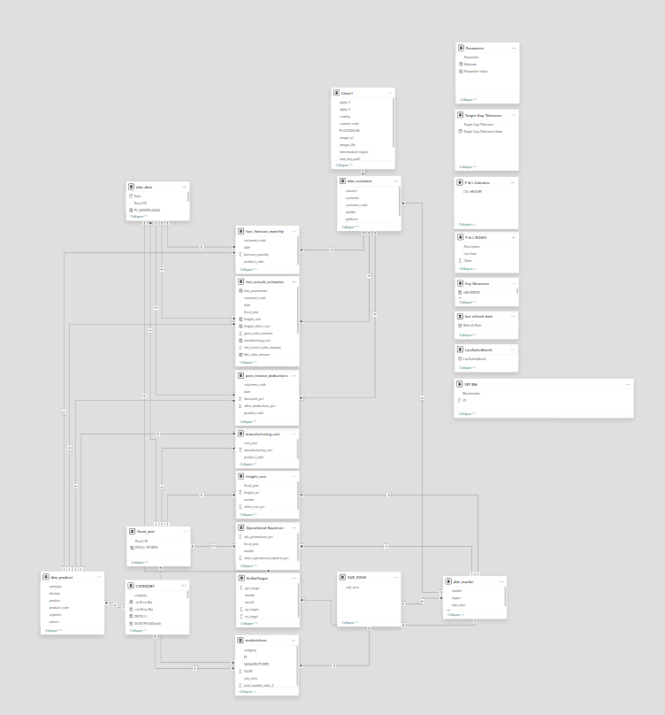
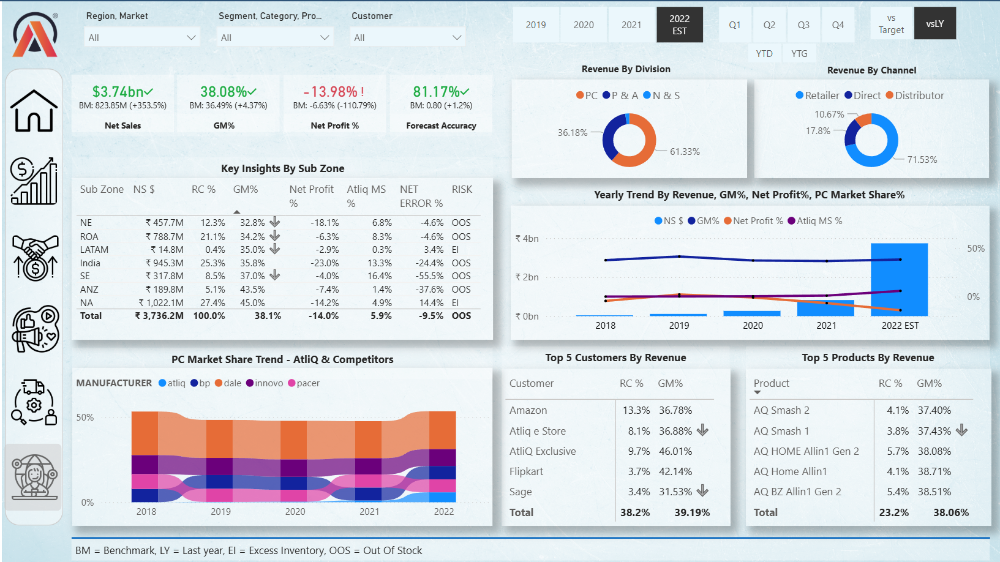
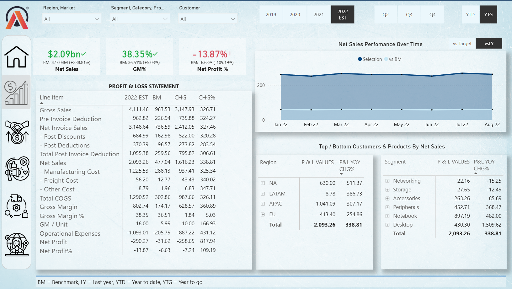
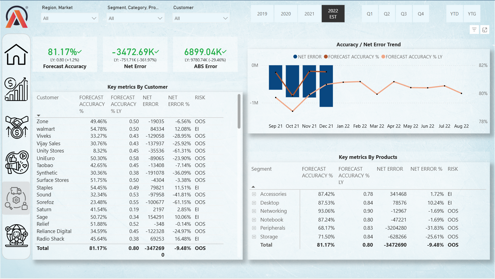

# Business Insights 360 – Power BI Dashboard

## Project Overview

Business Insights 360 is an end-to-end Power BI analytics project built for **AtliQ Hardware**, a global computer peripherals company. The organization earlier relied on static Excel reports, which limited visibility into performance and slowed decision-making. This solution provides interactive dashboards to monitor KPIs and analyze trends across Sales, Finance, Marketing, and Supply Chain.

---

## Business Objective

To build a centralized, data-driven reporting system that:

* Improves visibility into business performance
* Enables faster, informed decision-making
* Replaces static Excel reports with interactive dashboards

---

## Live Dashboard

[View Power BI Dashboard](https://app.powerbi.com/view?r=eyJrIjoiYzQ4YmNkZmItM2U1OC00ZWFiLWJjYTEtY2ExNGU4MjdlMzNlIiwidCI6ImM2ZTU0OWIzLTVmNDUtNDAzMi1hYWU5LWQ0MjQ0ZGM1YjJjNCJ9)

---

## Video Presentation

[Watch Project Walkthrough Video](https://youtu.be/wYL_ZEZaCWM?si=UoB4FGpjkW_04Zp2)

---

## Sales Analytics – Key Areas

* Customer-wise sales performance across multiple years
* Division-level sales comparison (2020 vs 2021)
* Gross Margin % analysis by quarter and sub-zone
* Market performance vs assigned targets
* New product sales contribution
* Top & bottom products by revenue
* Top revenue-generating countries

### Sales Insights

* Revenue increased from **$87.5M (2019)** to **$598.9M (2020)**
* Net sales grew by **204.5% over three years**
* India emerged as the highest revenue-generating market at **$161.3M**, followed by the USA at **$87.8M**
* P&A division revenue grew from **$105.2M to $338.4M (2021)**
* Top new products:

  * AQ Qwerty – **$22.0M**
  * AQ Trigger – **$20.7M**
  * AQ Gen Y – **$19.5M**

---

## Finance Analytics – Key Areas

* Yearly Profit & Loss analysis
* Monthly Profit & Loss trends
* Market-wise P&L performance
* Quarterly Gross Margin % by sub-zone

### Finance Insights

* Strong revenue expansion observed in 2021
* Profit margins remained stable despite increasing operational costs
* Regional profitability variations supported targeted strategic decisions

---

## Data Model

The data model follows a **snowflake-style schema**, designed for scalability and accuracy:

* Fact tables for sales, finance, and operational data
* Normalized dimension tables (Date, Customer, Product, Market)
* Shared dimensions enabling cross-functional analysis

---

## Tools & Technologies

* Power BI
* Power Query
* DAX
* Advanced Excel
* Power Pivot

---

## Key Technical Skills Applied

* ETL (Extract, Transform, Load) processes
* Custom date table creation
* Fiscal month and quarter calculations
* Data modeling using Power Pivot
* DAX measures and calculated columns
* Dashboard optimization and performance tuning

---

## Dashboard Screenshots

### Executive Overview

### Sales & Finance Dashboard

### Supply Chain Analysis

---

## Outcome

This project enabled stakeholders to:

* Identify high-performing markets and products
* Track profitability across regions
* Evaluate business performance with real-time insights
* Make informed sales and financial decisions using interactive dashboards

---

## Author

**Debjit Dey**
Aspiring Data Analyst
